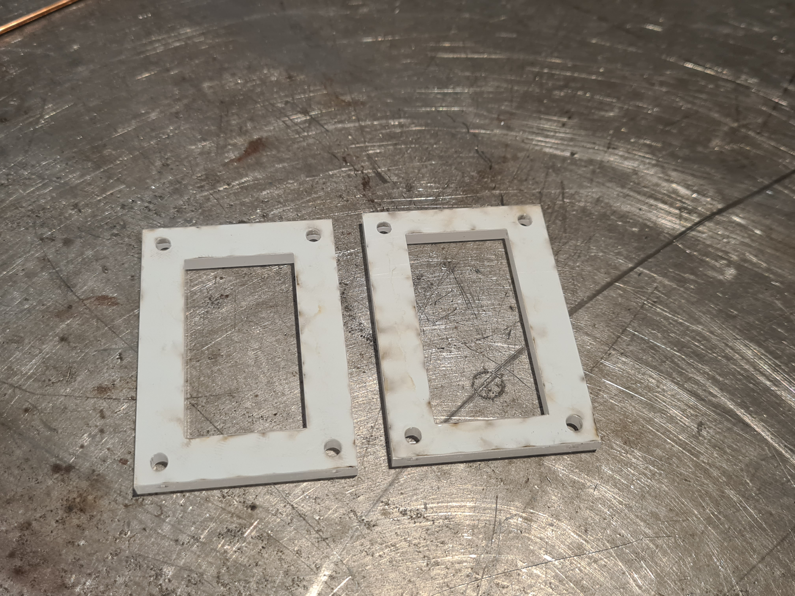
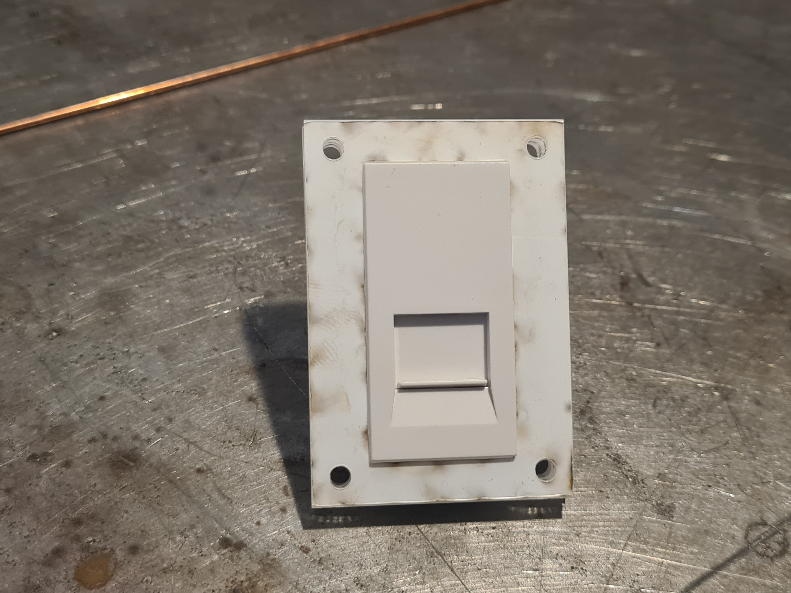
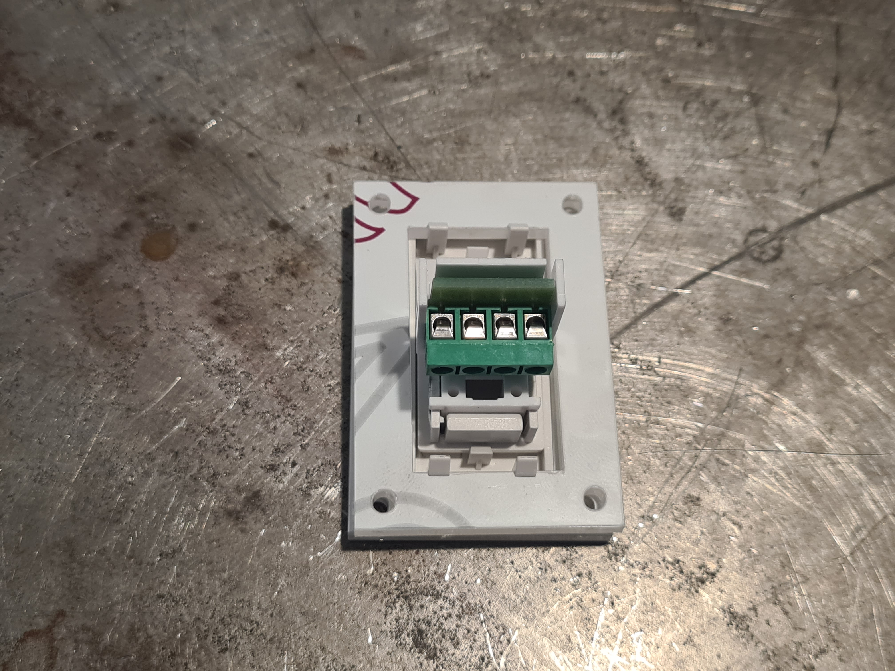
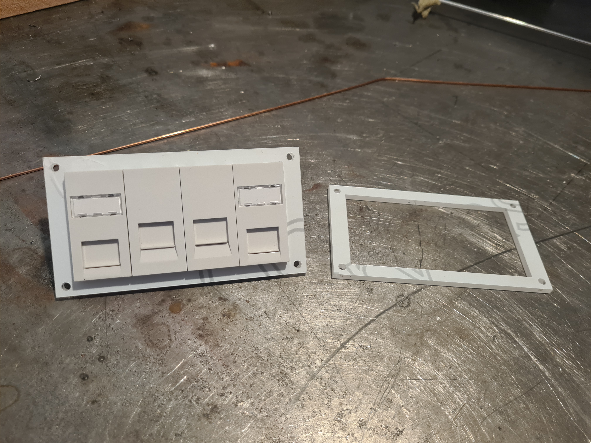
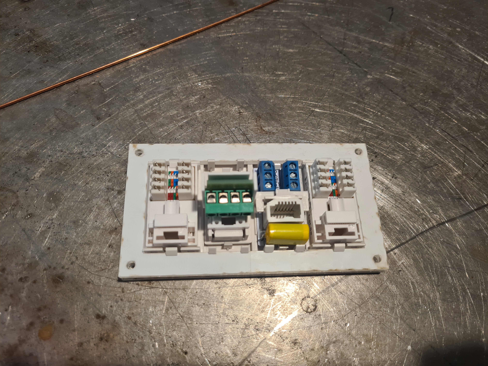

# Laser Cut Euro Module Holder
I have a couple of projects in the pipeline that will use Euro Modules to expose various connectors on a panel, however the existing 1 and 2 gang Euro Module plates take up unnecessary space. To save space I've created laser cut module holders which can be adapted as required.  

## Images

Single Plate Unassembled:  

Single Plate Assembled Front:  

Single Plate Assembled Rear:  

Quad Plate Assembled Front:  

Quad Plate Assembled Rear:  

## Assembly

- Cut the rear mount out of 4mm acrylic with a laser cutter (It *must* be 4mm as thats the correct size for the clips)
- Cut the front plate out of acrylic - thickness is less critical. 5mm will give you an almost flush end result. 
- Insert the modules into the back plate
- Push the front plate onto the back plate to secure the modules
- Attach to your panel

## Licence

This project is licensed under the [Creative Commons CC BY-NC-SA 4.0](https://creativecommons.org/licenses/by-nc-sa/4.0/) licence.

You are free to share and adapt the code as required, however you *must* give appropriate credit and indicate what changes have been made. You must also distribute your adaptation under the same license. Commercial use is prohibited.

## Acknowledgements

Thanks to the [London Hackspace](https://london.hackspace.org.uk/) for use of the Laser Cutter.

